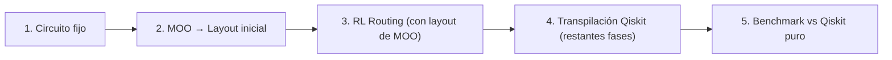

# Análisis: Mínimo para cerrar el proyecto (pipeline end-to-end)

## Flujo deseado



---

## Estado actual por pieza

| Pieza | Estado | Archivos clave |
|-------|--------|----------------|
| **Circuito fijo** | ✅ HECHO | `qiskit_interface.circuit_utils` — `create_ghz_circuit`, `create_qft_circuit`, `load_circuit` |
| **MOO → Layout** | ✅ HECHO | `mo_module.optimize_layout_quick()` → `result.get_compromise_layout()` |
| **Layout → RL env** | ✅ HECHO | `QuantumTranspilationEnv.reset(options={"initial_layout": [...]})` acepta layouts externos |
| **RL Routing episodio** | ✅ HECHO | `routing_evaluator.evaluate_routing_episode()` ejecuta un episodio completo y devuelve `RoutingEpisodeSummary` |
| **RL → circuito transpilado** | ❌ **FALTA** | El RL env ejecuta SWAPs internamente pero **NO reconstruye un `QuantumCircuit`** con los SWAPs insertados |
| **Fases restantes Qiskit** | ❌ **FALTA** | Una vez reconstruido el circuito con SWAPs, falta pasar por translation/optimization de Qiskit |
| **Benchmark comparativo** | ⚠️ PARCIAL | `benchmark_gui.py` compara MO vs Qiskit, pero NO incluye la ruta RL |
| **Escenario MO+RL completo** | ⚠️ PARCIAL | `scenarios.py: run_mo_rl_scenario` existe pero solo devuelve `RoutingEpisodeSummary` (sin métricas de transpilación) |

---

## Las 3 GAPS concretas que faltan

### GAP 1 — Reconstruir el circuito ruteado desde el RL env ⭐ CRÍTICA

> [!IMPORTANT]
> Esta es la pieza central que falta. El RL env hace routing (SWAPs) pero no materializa el circuito resultante.

**Qué falta:** Una función que, dado el historial de SWAPs que el agente RL ejecutó durante un episodio y el layout final, reconstruya un `QuantumCircuit` válido con:
- Las puertas SWAP insertadas en las posiciones correctas.
- Las puertas originales remapeadas al layout actual.

**Dónde implementar:** `src/rl_module/` o `src/integration/` — nueva función tipo `reconstruct_routed_circuit(circuit, swap_history, initial_layout, coupling_map) → QuantumCircuit`.

**Enfoque mínimo viable:**
1. Extender `QuantumTranspilationEnv` (o un wrapper) para **registrar** cada SWAP y cada puerta ejecutada en orden.
2. Crear una función que recorra ese log y construya un `QuantumCircuit` con layout final incluido.

**Alternativa aún más simple (sin tocar el env):** Como el env ya devuelve `total_swaps`, `initial_layout`, y `final_layout`, se puede usar **Qiskit directamente**: pasar el `initial_layout` de MOO al `generate_preset_pass_manager` con `layout_method` fijado y dejar que Qiskit haga el routing estándar. Esto NO usa el routing del RL pero sí demuestra el pipeline completo (MO layout → Qiskit routing+translation+optimization → métricas). **Pero** pierde el sentido del RL routing.

**Enfoque recomendado (mínimo verdadero):**
- Modificar `evaluate_routing_episode()` para que **también** capture la secuencia ordenada de (swap_edges, executed_gates).
- Crear `build_routed_circuit(target_circuit, initial_layout, action_log) → QuantumCircuit` que reconstruya el circuito.
- El circuito resultante ya tiene el routing hecho → luego se pasa a Qiskit solo para translation + optimization.

**Estimación:** ~100-150 líneas de código.

### GAP 2 — Transpilación post-routing con Qiskit (translation + optimization)

> [!NOTE]
> Qiskit separa la transpilación en stages: `init → layout → routing → translation → optimization → scheduling`. Si el RL ya hizo el routing, hay que saltar layout y routing y hacer solo las fases restantes.

**Qué falta:** Una función que tome el circuito ya ruteado por RL y lo pase por las fases de `translation` (descomposición a basis gates) y `optimization` de Qiskit.

**Enfoque mínimo:**
```python
from qiskit.transpiler.preset_passmanagers import generate_preset_pass_manager

pm = generate_preset_pass_manager(
    optimization_level=1,
    backend=backend,
    initial_layout=initial_layout,  # layout del MOO/RL
)
# Eliminar las stages de layout y routing ya hechas por RL
pm.layout = None  # No re-hacer layout
pm.routing = None  # No re-hacer routing
result = pm.run(routed_circuit)
```

**Dónde implementar:** `src/qiskit_interface/transpiler.py` — nueva función `transpile_post_routing(routed_circuit, backend, optimization_level) → TranspilationResult`.

**Estimación:** ~30-50 líneas de código.

### GAP 3 — Cerrar el escenario MO+RL con métricas comparables

> [!NOTE]
> `run_mo_rl_scenario` ya existe pero devuelve `transpilation_metrics=None`. Hay que conectar GAP 1 + GAP 2 para que devuelva métricas reales.

**Qué falta:** Actualizar `scenarios.py: run_mo_rl_scenario` para:
1. Obtener el circuito ruteado de GAP 1.
2. Pasarlo por post-routing de GAP 2.
3. Devolver `transpilation_metrics` y `transpilation_artifact` reales (depth, 2Q gates, etc.)
4. El benchmark puede entonces comparar directamente con `run_baseline_scenario`.

**Estimación:** ~40-60 líneas modificadas en `scenarios.py`.

---

## Resumen del trabajo mínimo

| GAP | Qué | Dónde | Estimación |
|-----|-----|-------|-----------|
| **1** | Reconstruir circuito ruteado | `rl_module/` + `integration/routing_evaluator.py` | ~100-150 LOC |
| **2** | Post-routing Qiskit (translation+opt) | `qiskit_interface/transpiler.py` | ~30-50 LOC |
| **3** | Cerrar `MO+RL` con métricas | `integration/scenarios.py` | ~40-60 LOC |
| **Total** | | | **~170-260 LOC** |

---

## Lo que NO es estrictamente necesario para cerrar

- ❌ Entrenar un agente RL que funcione bien → se puede usar un **modelo ya entrenado** o incluso un agente aleatorio para demostrar el pipeline.
- ❌ Una GUI nueva → se puede hacer con un **script** o el `runner.py` de CLI que ya existe.
- ❌ Generalización del RL a múltiples circuitos → se puede fijar un solo circuito (GHZ-5).
- ❌ Optimización del RL → el pipeline funciona aunque el routing del RL sea malo.
- ❌ Benchmark GUI unificada → basta comparar numéricamente (print / DataFrame).

---

## Pipeline end-to-end simplificado (pseudocódigo)

```python
# 1. Circuito fijo
circuit = create_ghz_circuit(5)
backend = get_backend("fake_torino")

# 2. MOO → Layout
mo_result = optimize_layout_quick(circuit, backend, seed=42)
layout = mo_result.get_compromise_layout()

# 3. RL Routing 
agent = QuantumRLAgent.load("path/to/model.zip", env=None, algorithm="MaskablePPO")
routed_circuit, final_layout = run_rl_routing(   # ← GAP 1
    circuit, layout, backend, agent
)

# 4. Post-routing Qiskit
result = transpile_post_routing(                  # ← GAP 2
    routed_circuit, backend, optimization_level=1
)

# 5. Benchmark
baseline = transpile_circuit(circuit, backend, optimization_level=1)
print(f"Qiskit puro: depth={baseline.transpiled_metrics.depth}, 2Q={baseline.transpiled_metrics.two_qubit_gates}")
print(f"MO+RL:       depth={result.transpiled_metrics.depth}, 2Q={result.transpiled_metrics.two_qubit_gates}")
```

> [!TIP]
> Si quieres la ruta **absolutamente mínima** sin reconstruir circuitos: usar `transpile_with_custom_layout(circuit, layout, backend)` ya existente. Esto usa el layout del MOO y deja que Qiskit haga SU propio routing. No es "RL routing" pero demuestra MO layout → Qiskit transpilación → benchmark. Es lo que **ya hace `run_mo_only_scenario`**.

> [!CAUTION]  
> Para demostrar que el RL aporta valor hay que implementar GAP 1 obligatoriamente. Sin reconstrucción de circuito, el RL solo produce contadores (swap count, reward) que no son comparables con métricas de transpilación real (depth, gate count).
