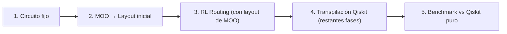

# Análisis: Mínimo para cerrar el proyecto (pipeline end-to-end)

## Flujo deseado



---

## Estado actual por pieza

| Pieza | Estado | Archivos clave |
|-------|--------|----------------|
| **Circuito fijo** | ✅ HECHO | `qiskit_interface.circuit_utils` — `create_ghz_circuit`, `create_qft_circuit`, `load_circuit` |
| **MOO → Layout** | ✅ HECHO | `mo_module.optimize_layout_quick()` → `result.get_compromise_layout()` |
| **Layout → RL env** | ✅ HECHO | `QuantumTranspilationEnv.reset(options={"initial_layout": [...]})` acepta layouts externos |
| **RL Routing episodio** | ✅ HECHO | `routing_evaluator.evaluate_routing_episode()` ejecuta un episodio completo y devuelve `RoutingEpisodeSummary` |
| **RL → circuito transpilado** | ✅ HECHO | `routing_evaluator.build_routed_circuit()` reconstruye el circuito físico desde `executed_gate_trace` + `swap_trace` (con fallback al replay por frontier si no hay traza exacta) |
| **Fases restantes Qiskit** | ✅ HECHO | `qiskit_interface.transpile_post_routing()` ejecuta translation/optimization sin rehacer layout/routing |
| **Benchmark comparativo** | ⚠️ PARCIAL | La ruta `MO+RL` ya devuelve métricas comparables; para layouts dispersos la comparación debe preferir `trans_active_qubits` frente a la anchura materializada `trans_num_qubits`/`trans_width`, y la capa de benchmarking/documentación comparativa todavía no está completamente alineada |
| **Escenario MO+RL completo** | ✅ HECHO | `scenarios.py: run_mo_rl_scenario` ya reconstruye, valida `final_layout` y devuelve métricas/artefacto cuando RL completa el routing |

---

## Gaps mínimos que todavía quedan

### GAP 1 — Comparativa/benchmarking homogéneo sobre la nueva ruta MO+RL

La reconstrucción exacta y el post-routing ya existen. Lo que sigue pendiente es explotar esa ruta de forma homogénea en los benchmarks y análisis comparativos de alto nivel.

**Qué falta:**
- incorporar `MO+RL` de forma consistente en los scripts/tablas de benchmarking;
- revisar documentación comparativa que aún asume que RL no materializa circuito final;
- añadir validaciones de regresión más amplias si el benchmark depende de artefactos persistidos.

### GAP 2 — Extender la misma reconstrucción exacta a `RL_Only` si se quiere comparabilidad total

`RL_Only` sigue exponiendo solo `RoutingEpisodeSummary`. Si se quisiera compararlo directamente con `Baseline`, `MO_Only` y `MO+RL`, habría que decidir si también debe reconstruir circuito final y pasar por `transpile_post_routing()`.

### GAP 3 — Verificación más amplia con casos reales/benchmarks persistidos

Falta comprobar esta ruta en campañas más grandes o artefactos históricos, no solo en tests dirigidos/unitarios-integration.

---

## Resumen del trabajo mínimo restante

| GAP | Qué | Dónde | Estimación |
|-----|-----|-------|-----------|
| **1** | Unificar benchmarking/comparativas con `MO+RL` | `benchmark_*`, docs, reporting | baja-media |
| **2** | Decidir si `RL_Only` debe materializar circuito final | `integration/scenarios.py`, contratos/docs | media |
| **3** | Validar la ruta en campañas más amplias | tests/scripts de benchmark | baja-media |

---

## Lo que NO es estrictamente necesario para cerrar

- ❌ Entrenar un agente RL que funcione bien → se puede usar un **modelo ya entrenado** o incluso un agente aleatorio para demostrar el pipeline.
- ❌ Una GUI nueva → se puede hacer con un **script** o el `runner.py` de CLI que ya existe.
- ❌ Generalización del RL a múltiples circuitos → se puede fijar un solo circuito (GHZ-5).
- ❌ Optimización del RL → el pipeline funciona aunque el routing del RL sea malo.
- ❌ Benchmark GUI unificada → basta comparar numéricamente (print / DataFrame).

---

## Pipeline end-to-end simplificado (pseudocódigo)

```python
# 1. Circuito fijo
circuit = create_ghz_circuit(5)
backend = get_backend("fake_torino")

# 2. MOO → Layout
mo_result = optimize_layout_quick(circuit, backend, seed=42)
layout = mo_result.get_compromise_layout()

# 3. RL Routing + reconstrucción exacta
agent = QuantumRLAgent.load("path/to/model.zip", env=None, algorithm="MaskablePPO")
routing_summary = evaluate_routing_episode(...)
routed_circuit, final_layout = build_routed_circuit(
    circuit=circuit,
    coupling_edges=coupling_edges,
    initial_layout=layout,
    swap_trace=routing_summary.swap_trace,
    executed_gate_trace=routing_summary.executed_gate_trace,
    frontier_mode="sequential",
)

# 4. Post-routing Qiskit
result = transpile_post_routing(
    routed_circuit, backend, optimization_level=1
)

# 5. Benchmark
baseline = transpile_circuit(circuit, backend, optimization_level=1)
print(f"Qiskit puro: depth={baseline.transpiled_metrics.depth}, 2Q={baseline.transpiled_metrics.two_qubit_gates}")
print(f"MO+RL:       depth={result.transpiled_metrics.depth}, 2Q={result.transpiled_metrics.two_qubit_gates}")
```

> [!TIP]
> Si quieres la ruta **absolutamente mínima** sin reconstruir circuitos: usar `transpile_with_custom_layout(circuit, layout, backend)` ya existente. Esto usa el layout del MOO y deja que Qiskit haga SU propio routing. No es "RL routing" pero demuestra MO layout → Qiskit transpilación → benchmark. Es lo que **ya hace `run_mo_only_scenario`**.

> [!CAUTION]  
> La reconstrucción exacta ya existe para `MO+RL`, pero `RL_Only` sigue siendo un resumen de episodio. No conviene mezclar comparativas entre escenarios asumiendo que todos producen hoy un circuito final materializado.
